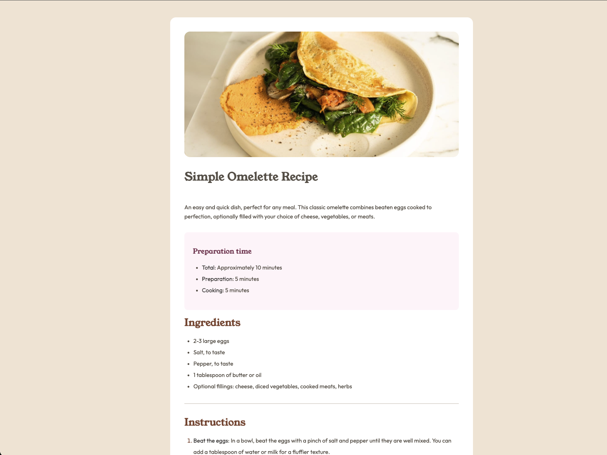
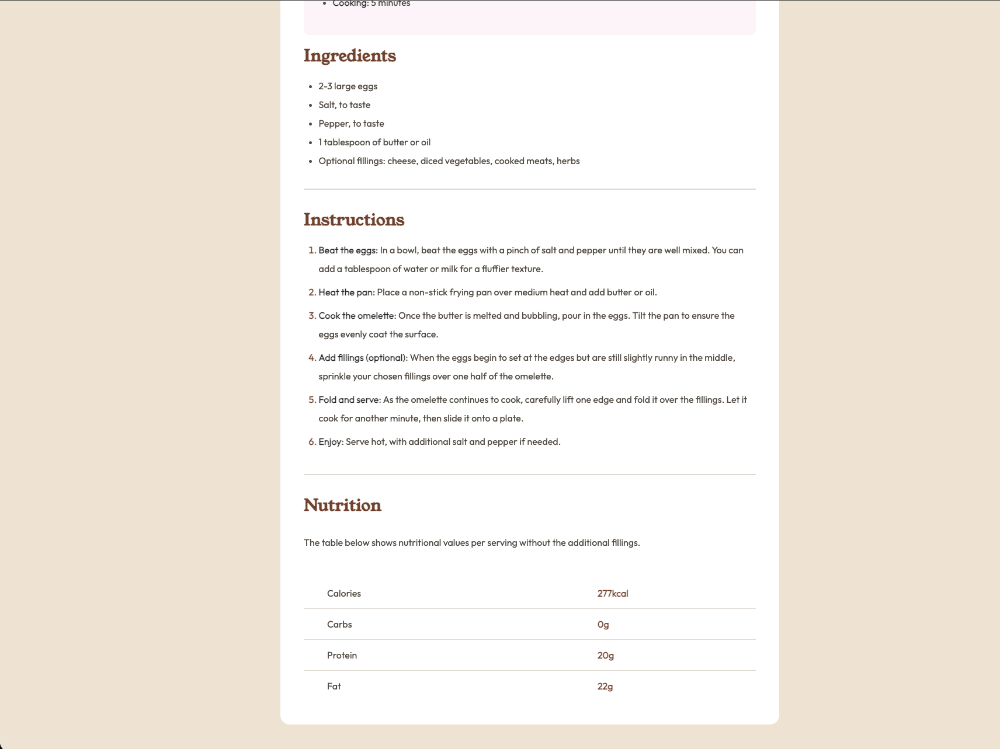

# Frontend Mentor - Recipe page solution

This is a solution to the [Recipe page challenge on Frontend Mentor](https://www.frontendmentor.io/challenges/recipe-page-KiTsR8QQKm). Frontend Mentor challenges help you improve your coding skills by building realistic projects.

## Table of contents

- [Frontend Mentor - Recipe page solution](#frontend-mentor---recipe-page-solution)
  - [Table of contents](#table-of-contents)
  - [Overview](#overview)
    - [Screenshot](#screenshot)
    - [Links](#links)
  - [My process](#my-process)
    - [Built with](#built-with)
    - [What I learned](#what-i-learned)
    - [Continued development](#continued-development)
  - [Author](#author)
  - [Acknowledgments](#acknowledgments)

**Note: Delete this note and update the table of contents based on what sections you keep.**

## Overview

### Screenshot

### Links

- Solution URL: [Add solution URL here](https://your-solution-url.com)
- Live Site URL: [Add live site URL here](https://your-live-site-url.com)

## My process

### Built with

- Semantic HTML5 markup
- CSS custom properties
- Flexbox

### What I learned

I learned how to style the list's items.

### Continued development

I am planning to learn **Tailwind css** and rebuild this project.

## Author

- Github - [mr-mib](https://github.com/mr-mib)
- Frontend Mentor - [@mr-mib](https://www.frontendmentor.io/profile/mr-mib)
- Twitter - [@mr_mib_dev](https://x.com/mr_mib_dev)

---

## Acknowledgments

This project was completed independently as part of my learning journey.

Special acknowledgment to the Frontend Mentor platform for providing structured, real-world frontend challenges.
